# Multi-Tenant Architecture Flow

This document outlines the complete request lifecycle and architectural flow for the newly implemented multi-tenant system in `SmreaderAPI`.

## 1. Request Lifecycle Overview

When a user makes a request to the API, the system needs to determine *which* tenant database they belong to before executing any queries. Here is how that flow works:

```mermaid
sequenceDiagram
    participant Client
    participant API as API Pipeline
    participant Middleware as TenantResolutionMiddleware
    participant ITenantContext
    participant Cache as TenantConnectionCacheService
    participant MasterDB as Master Database (ca_management)
    participant EFCore as SmreaderDbContext / DapperContext
    participant TenantDB as Tenant Database (ca_users)

    Client->>API: HTTP Request + JWT Bearer Token
    
    rect rgb(30, 40, 50)
        Note over API, Middleware: 1. Authentication & Resolution
        API->>Middleware: Intercept Request
        Middleware->>Middleware: Extract "TenantId" claim from JWT
        Middleware->>ITenantContext: SetTenantId(TenantId)
    end

    API->>EFCore: Service invokes DbContext/Dapper
    
    rect rgb(30, 50, 40)
        Note over EFCore, MasterDB: 2. Connection String Resolution
        EFCore->>ITenantContext: Get active TenantId
        EFCore->>Cache: GetConnectionStringAsync(TenantId)
        
        alt Cache Miss
            Cache->>MasterDB: SELECT db_name, db_user... WHERE id = TenantId
            MasterDB-->>Cache: Return tenant credentials
            Cache->>Cache: Build MySQL Connection String
            Cache->>Cache: Store in MemoryCache (30 mins)
        end
        
        Cache-->>EFCore: Return Connection String
    end

    rect rgb(50, 30, 40)
        Note over EFCore, TenantDB: 3. Tenant Data Access
        EFCore->>EFCore: OnConfiguring: UseMySql(ConnectionString)
        EFCore->>TenantDB: Execute SQL Query (e.g., SELECT from ca_users)
        TenantDB-->>EFCore: Return Data
    end
    
    EFCore-->>API: Return Entities / DTOs
    API-->>Client: HTTP Response
```

## 2. Key Components Explained

### A. The Master Database (`ca_management`)
The master database is the central source of truth for tenant configurations. It contains the `ca_management` table, which holds the dynamic database names, usernames, and passwords for each tenant. 

### B. Login & Authentication Flow
1. **User Logs In**: The user sends their email, password, and `TenantId` (selected from a dropdown or derived from a subdomain).
2. **Context Setup**: `UserService.LoginAsync` immediately sets the `TenantId` in the `ITenantContext`.
3. **Verification**: The system dynamically connects to that specific tenant's database to verify the user against the `ca_users` table.
4. **Token Generation**: If valid, the `AuthService` generates a JWT that embeds the `TenantId` as a permanent claim.

### C. Subsequent Requests (Middleware)
For any request made *after* login:
1. The user attaches their JWT token to the `Authorization` header.
2. The `TenantResolutionMiddleware` intercepts the request, reads the `TenantId` from the token claims, and injects it into the scoped `ITenantContext`.
3. The rest of the application (Controllers, Services) now inherently knows which tenant is making the request without needing the `TenantId` to be passed in every single API endpoint parameter.

### D. Connection Caching
To prevent querying the master database on every single API request, the `TenantConnectionCacheService` is used. 
- When a connection string is resolved for a `TenantId`, it is stored in `IMemoryCache` for 30 minutes.
- Subsequent requests for the same `TenantId` will instantly retrieve the compiled connection string from memory, resulting in blazing fast database switching.

### E. Data Access (EF Core & Dapper)
- **EF Core (`SmreaderDbContext`)**: When a repository injects the DbContext, EF Core triggers the `OnConfiguring` method. Here, it asks the cache for the active connection string and configures itself to target the correct MySQL database.
- **Dapper (`DapperContext`)**: Whenever a raw SQL query is needed, `CreateConnection()` fetches the active connection string and opens a new `MySqlConnection` to the correct tenant database.
